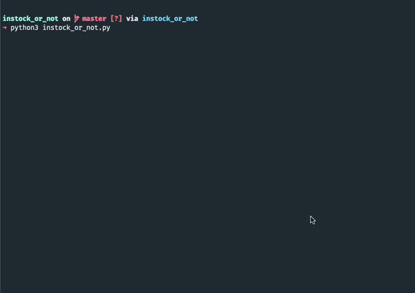

# Supreme Item Availibity Scraper
Script that shows you what items are currently in stock on the Supreme web store. 

1. Clone the repo
2. cd instock_or_not
3. pipenv shell
4. pipenv install
5. python3 instock_or_not.py

